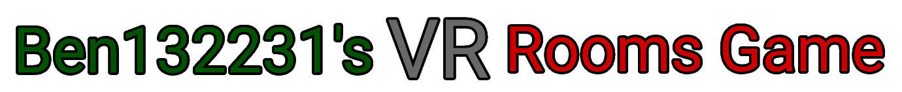
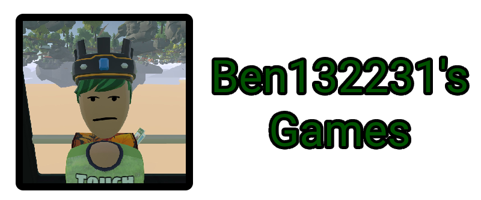

# 

)

This is the open source project for Ben132231's VR Rooms Game.

The game is a Roblox Rooms fangame but built on the Unity Engine Plus With Gorilla Locomotion.

# Warning

This open source project is mosty for people that know how to use the Unity Engine.

And is good with VR game development.

# Important Info

If you are going to download the project.

Before you doing anything make sure you set up a Keystore in your project.

If you don't know how. heres a Unity Docummentation on how to do that.

https://docs.unity3d.com/Manual/android-keystore-create.html

#

